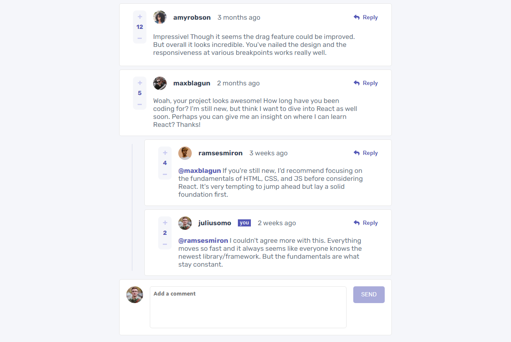
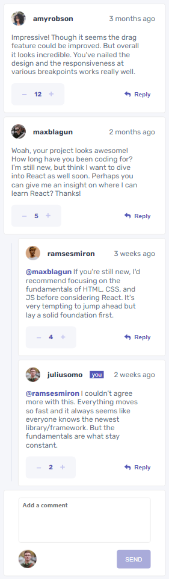

# Frontend Mentor - Interactive comments section solution

This is a solution to the [Interactive comments section challenge on Frontend Mentor](https://www.frontendmentor.io/challenges/interactive-comments-section-iG1RugEG9). Frontend Mentor challenges help you improve your coding skills by building realistic projects.

## Table of contents

- [Overview](#overview)
  - [The challenge](#the-challenge)
  - [Screenshot](#screenshot)
  - [Links](#links)
- [My process](#my-process)
  - [Built with](#built-with)
  - [What I learned](#what-i-learned)
  - [Continued development](#continued-development)
  - [Useful resources](#useful-resources)
- [Author](#author)
- [Acknowledgments](#acknowledgments)

## Overview

### The challenge

Users should be able to:

- View the optimal layout for the app depending on their device's screen size
- See hover states for all interactive elements on the page
- Create, Read, Update, and Delete comments and replies
- Upvote and downvote comments
- **Bonus**: If you're building a purely front-end project, use `localStorage` to save the current state in the browser that persists when the browser is refreshed.
- **Bonus**: Instead of using the `createdAt` strings from the `data.json` file, try using timestamps and dynamically track the time since the comment or reply was posted.

### Screenshot




### Links

- Solution URL: [Intractive comments Section](https://github.com/Catalyst497/Interactive-comments-section)
- Live Site URL: https://fm-interactive-comments-section.netlify.app/

## My process

### Built with

- Semantic HTML5 markup
- Flexbox
- CSS Grid
- SCSS
- [React](https://reactjs.org/) - JS library

### What I learned

Ebunski : -

- Converting from static to dynamic mark-up and react set-up exercise
- Setting a state to manage id
- CRUD operation -
  Had problems with adding and deleting from nested arrays.
- Reusing components (e.g markdown and comment components) , recursive rendering, default props etc.
- Dynamic and conditional rendering e.g action buttons, replies, markdown, photo etc.
- Time tracker code.

Catalyst : -

- Got to brush up on my usage of Git and GitHub. Finally, understood what I was doing a bit.
- Had to revise my knowledge of grid layout(specifically grid-area)

````css
.proud-of-this {
  grid-template-columns: 4rem auto auto repeat(3, 1fr);
    grid-template-areas:
      'li id id tm re re'
      'li ct ct ct ct ct'
      'sm ct ct ct ct ct';
}
```
- Got to sneak peak into React and how it works, gained a lot there.

Overall :-
-Teamwork: 1st time i actually collaborated with someone on a project
- Git and Github - understood the architecture, workflow and other git commands


### Continued development

- React
- SCSS

### Useful resources

## Author

- Frontend Mentor - [@Catalyst497](https://www.frontendmentor.io/profile/Catalyst497)
- Twitter - [@Catalyst497](https://twitter.com/Catalyst497)


## Acknowledgments

Thank you frontend mentor.
````
